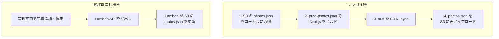
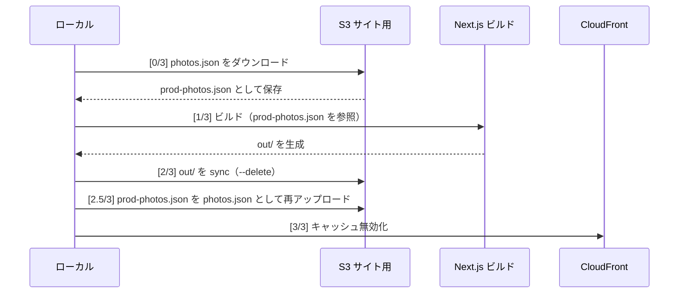
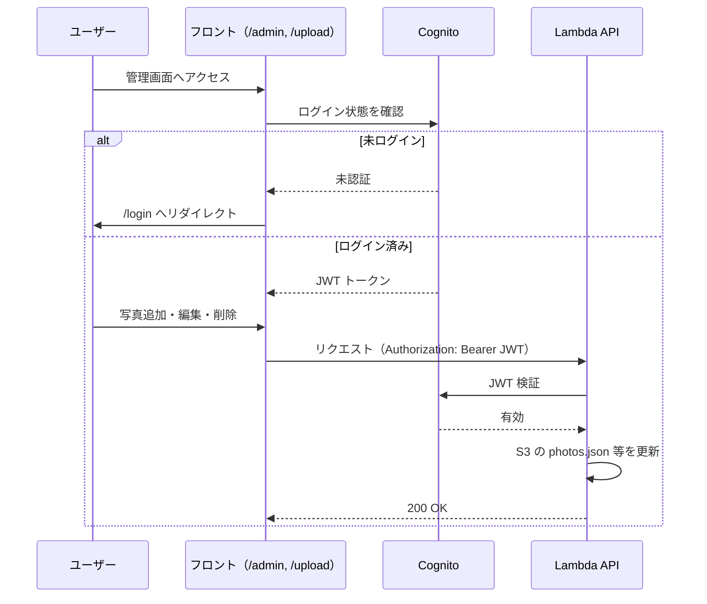

# 既存設計図（Photo Gallery）

このドキュメントは、現在の Photo Gallery の設計をまとめたものです。ブログ追加時や機能拡張時の参照用です。

**視覚的な構成図をブラウザで見る:** [`docs/design-diagram.html`](./design-diagram.html) をブラウザで開くと、Mermaid で描いた全体アーキテクチャ・パス振り分け・データフロー・デプロイ・ページ構成・認証の流れが図として表示されます。

- **開き方**: エクスプローラーで `docs/design-diagram.html` をダブルクリックするか、ブラウザのアドレスバーに `file:///` のあとプロジェクト内の `docs/design-diagram.html` のフルパスを入力する（例: `file:///C:/Users/.../photo-gallery/docs/design-diagram.html`）。VS Code ではファイルを右クリック → **Reveal in File Explorer** でフォルダを開いてから該当ファイルをダブルクリックしてもよい。

---

## 📋 目次

0. [視覚的な構成図](#0-視覚的な構成図)
1. [全体構成](#1-全体構成)
2. [フロントエンド（Next.js）](#2-フロントエンドnextjs)
3. [データの流れ](#3-データの流れ)
4. [API（Lambda）](#4-apilambda)
5. [AWS リソース](#5-aws-リソース)
6. [デプロイの流れ](#6-デプロイの流れ)
7. [開発環境と本番環境](#7-開発環境と本番環境)
8. [認証](#8-認証)

---

## 0. 視覚的な構成図

> GitHub・VS Code・Mermaid 対応の Markdown ビューアで開くと図として表示されます。

### 全体アーキテクチャ

```mermaid
flowchart TB
    subgraph ユーザー
        U[ユーザー / ブラウザ]
    end

    subgraph 配信
        CF[CloudFront<br/>journey-photo.com]
    end

    subgraph AWS
        subgraph 静的サイト
            S3_SITE[S3 サイト用バケット<br/>HTML / JS / photos.json]
        end
        subgraph API
            APIGW[API Gateway]
            LAMBDA[Lambda]
        end
        subgraph ストレージ
            S3_IMG[S3 画像用バケット<br/>uploads/*]
        end
    end

    U -->|"/" "/gallery" "/about" 等| CF
    U -->|"/api/*" 管理画面から| CF
    U -->|"/uploads/*" 画像参照| CF

    CF -->|静的ページ| S3_SITE
    CF -->|/api/*| APIGW
    CF -->|/uploads/*| S3_IMG

    APIGW --> LAMBDA
    LAMBDA -->|読書・更新| S3_SITE
    LAMBDA -->|読書・削除| S3_IMG
```

### パス別の振り分け

```mermaid
flowchart LR
    subgraph CloudFront
        CF[リクエスト]
    end

    CF -->|"/" や "/gallery" 等| S3[S3 サイト用<br/>静的ファイル]
    CF -->|"/api/photos" 等| API[API Gateway<br/>→ Lambda]
    CF -->|"/uploads/xxx.jpg"| IMG[S3 画像用<br/>画像ファイル]
```

### 写真データの流れ（本番）



### デプロイの流れ（web:deploy:prod）



### ページ構成（フロントエンド）

```mermaid
flowchart TB
    subgraph 一般
        TOP["/ トップ"]
        GALLERY["/gallery ギャラリー"]
        PHOTO["/photo/[id] 写真詳細"]
        ABOUT["/about 制作について"]
        NEWS["/news お知らせ"]
        FAV["/favorites お気に入り"]
        HIST["/history 閲覧履歴"]
    end
    subgraph 管理・認証
        ADMIN["/admin 管理トップ"]
        EDIT["/admin/edit/[id] 編集"]
        UPLOAD["/upload アップロード"]
        LOGIN["/login ログイン"]
    end
    TOP --> GALLERY
    GALLERY --> PHOTO
    ADMIN --> EDIT
    ADMIN --> UPLOAD
    LOGIN --> ADMIN
```

### 認証の流れ（管理画面・API）



---

## 1. 全体構成

```
[ユーザー]
    │
    ▼
[CloudFront]  journey-photo.com
    │
    ├─ /, /gallery, /about, ...  ──► [S3 サイト用バケット]  静的 HTML/JS/CSS
    │                                    └─ app/data/photos.json（写真一覧）
    │
    ├─ /api/*  ──► [API Gateway] ──► [Lambda] ──► [S3]  photos.json 読書
    │                                    │
    │                                    └─ [S3 画像用バケット]  uploads/* 読書
    │
    └─ /uploads/*  ──► [S3 画像用バケット]  画像ファイル

[管理画面]  /admin, /upload
    │
    └─ 認証: Cognito ログイン
    └─ API 呼び出し: GET/POST/PUT/DELETE（Lambda）
```

- **静的サイト**: Next.js を静的エクスポート（`out/`）し、S3 に配置。CloudFront で配信。
- **写真一覧**: ビルド時にローカルの `prod-photos.json` を読み込み、静的ページに焼き込む。本番の「最新」は S3 の `app/data/photos.json` をデプロイ前に取得してからビルド。
- **API**: 写真の取得・登録・更新・削除、アップロード用 Presigned URL 発行。Lambda が S3 の `photos.json` と `uploads/*` を操作。
- **認証**: 管理画面・API（POST/PUT/DELETE）は Cognito で保護。

---

## 2. フロントエンド（Next.js）

| 役割 | 内容 |
|------|------|
| **ビルド** | `npm run build` → `scripts/prepare-static-build.js` で `app/api` を一時退避し、Next.js が静的エクスポート。出力は `out/`。 |
| **データ参照** | ビルド時に `app/data/dev-photos.json` または `app/data/prod-photos.json` を読み込み。API はビルド時には使わない（静的サイトのため）。 |
| **本番での API 利用** | 管理画面（/admin, /upload）のみ、`NEXT_PUBLIC_API_BASE_URL` 経由で Lambda を呼ぶ。一般ユーザー向けページは API を呼ばず、ビルド済みの JSON を利用。 |

**主要ページ**

| パス | 役割 |
|------|------|
| `/` | トップ（作品一覧） |
| `/gallery` | ギャラリー（フィルター・検索） |
| `/photo/[id]` | 写真詳細（SSG） |
| `/about` | 制作について |
| `/news` | お知らせ |
| `/favorites` | お気に入り |
| `/history` | 閲覧履歴 |
| `/admin` | 管理トップ（写真一覧・編集・削除） |
| `/admin/edit/[id]` | 写真編集 |
| `/upload` | 写真アップロード |
| `/login` | ログイン |

**データ・設定の置き場所**

| 場所 | 内容 |
|------|------|
| `app/data/photos.ts` | 型定義・ローカル用の getPhotos（dev-photos.json / prod-photos.json を読む） |
| `app/data/dev-photos.json` | 開発用写真一覧（ローカル・dev 用） |
| `app/data/prod-photos.json` | 本番用写真一覧（URL を本番用にしたもの）。デプロイ時に S3 から取得してビルドに使用。 |
| `app/i18n/` | 多言語（日本語・英語）の文言 |
| `lib/utils/seo.ts` | サイト名・URL・OGP 画像パスなど |

---

## 3. データの流れ

### 写真一覧（photos.json）

```
[開発]
  編集: app/data/dev-photos.json（手動 or 管理画面で API 経由で Lambda が更新）
  参照: ビルド時に dev-photos.json を読んで静的ページを生成

[本番]
  保存先: S3 サイト用バケットの app/data/photos.json
  更新方法:
    1) 管理画面で写真を追加・編集 → Lambda が S3 の photos.json を更新
    2) または ローカルで prod-photos.json を編集 → npm run upload:photos:prod で S3 にアップロード
  ビルド時:
    web:deploy:prod の [0/3] で S3 の app/data/photos.json をローカル prod-photos.json にダウンロード
    → その prod-photos.json で Next.js をビルド
    → [2/3] で out/ を S3 に sync（このとき photos.json は消える）
    → [2.5/3] で prod-photos.json を S3 の app/data/photos.json に再アップロード
```

- 本番の「正」は S3 の `app/data/photos.json`。デプロイのたびに「本番 S3 → ローカル取得 → ビルド → 再アップロード」で、管理画面で登録した内容を上書きしないようにしている。

### 画像ファイル（uploads/*）

```
アップロード: 管理画面 → Lambda（Presigned URL 発行） → ブラウザが S3 画像用バケットに直接アップロード
             → Lambda（/api/upload/save）で photos.json にメタデータ追加
保存先: S3 画像用バケットの uploads/{id}.jpg など
参照: 写真の src は本番 URL（CloudFront 経由または S3 の URL）
```

---

## 4. API（Lambda）

**エンドポイント（API Gateway / CloudFront 経由で `/api` プレフィックス）**

| メソッド | パス | 認証 | 役割 |
|----------|------|------|------|
| GET | /api/photos | 不要 | 写真一覧取得（S3 の photos.json を返す） |
| GET | /api/photos/{id} | 不要 | 1件取得 |
| POST | /api/upload/presigned-url | 必要 | アップロード用 Presigned URL 発行 |
| POST | /api/upload/save | 必要 | アップロード完了後、photos.json に追加 |
| PUT | /api/photos/{id} | 必要 | 写真メタデータ更新 |
| DELETE | /api/photos/{id} | 必要 | 写真削除（photos.json から削除、S3 の画像も削除） |

- Lambda は `api/handler.js`。Secrets Manager から設定（S3 バケット名など）を取得。
- 参照する S3: サイト用バケットの `app/data/photos.json`、画像用バケットの `uploads/*`。

---

## 5. AWS リソース

| リソース | 開発（dev） | 本番（prod） | 役割 |
|----------|-------------|--------------|------|
| **S3 サイト用** | dev-journey-photo.com | prod-journey-photo.com 等 | 静的サイト（HTML/JS）、app/data/photos.json |
| **S3 画像用** | dev-journey-photo-upload | prod-journey-photo-upload | uploads/* 画像ファイル |
| **Lambda** | photo-gallery-api-dev-api | photo-gallery-api-prod-api | API 処理（写真 CRUD・Presigned URL・upload/save） |
| **API Gateway** | HTTP API（dev） | CloudFront 経由で /api/* を Lambda に転送 | ルーティング |
| **CloudFront** | （任意） | 1 ディストリビューション | / → S3 サイト、/api/* → API Gateway、/uploads/* → S3 画像用 |
| **Cognito** | User Pool（dev） | User Pool（prod） | 管理画面・API の認証 |
| **Secrets Manager** | dev-journey-photo-upload | prod-journey-photo-upload | AWS_S3_SITE_BUCKET_NAME、AWS_S3_BUCKET_NAME（画像用）、COGNITO_USER_POOL_ID、CLOUDFRONT_DISTRIBUTION_ID 等 |

---

## 6. デプロイの流れ

| コマンド | 内容 |
|----------|------|
| `npm run deploy:prod` | predeploy（lint・型チェック）→ api:deploy:prod → web:deploy:prod |
| `npm run api:deploy:prod` | Lambda + API Gateway を本番用にデプロイ（Serverless Framework） |
| `npm run web:deploy:prod` | [0/3] 本番 S3 から photos.json を取得 → [1/3] Next.js ビルド → [2/3] out/ を S3 に sync → [2.5/3] photos.json を S3 に再アップロード → [3/3] CloudFront 無効化 |
| `npm run upload:photos:prod` | ローカル prod-photos.json を S3 の app/data/photos.json としてアップロード |
| `npm run convert:photos:prod` | dev-photos.json の URL を本番用に変換して prod-photos.json を生成 |

- 静的サイトは「ビルド時に使うデータを S3 から取得してからビルド」が前提。ブログを追加する場合も、`blog-posts.json` を同様に S3 に置き、デプロイ前に取得してビルドに含める形にすると既存設計と揃う。

---

## 7. 開発環境と本番環境

| 項目 | 開発 | 本番 |
|------|------|------|
| 写真データ（ローカル） | app/data/dev-photos.json | app/data/prod-photos.json |
| 写真データ（S3） | サイト用バケットの app/data/photos.json（任意） | サイト用バケットの app/data/photos.json |
| API | api:deploy:dev でデプロイした Lambda、または Next.js の app/api（ローカル） | api:deploy:prod + CloudFront 経由 |
| 環境変数 | .env.local（NEXT_PUBLIC_* 等） | .env.production（ビルド時に埋め込み） |
| Secrets Manager | dev-journey-photo-upload | prod-journey-photo-upload |

---

## 8. 認証

- **Cognito**: 管理画面（/admin, /upload）のログイン、および API の POST/PUT/DELETE で JWT を検証。
- **フロント**: `app/auth/context.tsx` で Cognito の認証状態を管理。ログイン後、API 呼び出し時に Authorization ヘッダーでトークンを付与。
- **Lambda**: handler 内で JWT を検証し、未認証の場合は 401 を返す。

---

## ブログを追加する場合（既存設計の延長）

- **データ**: S3 サイト用バケットに `app/data/blog-posts.json` を追加。形式は配列（id, slug, title, body, date, published 等）。
- **API**: 既存 Lambda に GET/POST/PUT/DELETE `/api/blog` および `/api/blog/[id]` を追加。認証は写真の管理 API と同様に Cognito。
- **管理画面**: 管理画面に「ブログ」を追加し、一覧・新規・編集・削除の画面から上記 API を呼ぶ。
- **デプロイ**: web:deploy:prod の [0/3] で本番 S3 から `blog-posts.json` も取得し、ビルドに利用。sync 後に `blog-posts.json` も再アップロードするステップを追加。
- **フロント**: `/blog`（一覧）、`/blog/[slug]`（記事）を静的生成。ビルド時に取得した blog-posts.json を参照。

このようにすると、**既存の「Lambda + S3 + デプロイ時に S3 から取得してビルド」という設計のまま**ブログを追加できます。

---

## 参照

- [本番デプロイ（DEPLOY.md）](./DEPLOY.md) … デプロイ手順・URL・トラブルシューティング
- [環境構成（ENVIRONMENT_CONFIG.md）](./ENVIRONMENT_CONFIG.md) … 環境変数・AWS リソース一覧
- [写真データ（app/data/README.md）](../app/data/README.md) … dev-photos.json / prod-photos.json の役割
